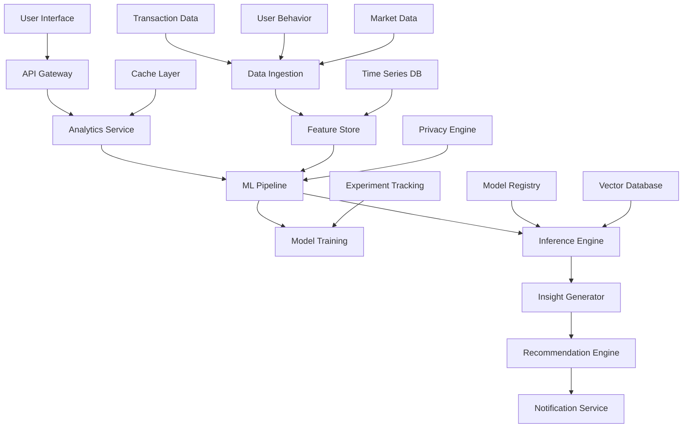

# AI-Powered Financial Analytics - Design Document

## Overview

The AI-Powered Financial Analytics system is a comprehensive machine learning platform that analyzes user financial data to provide intelligent insights, predictive analytics, and personalized recommendations. The system leverages advanced ML algorithms, real-time data processing, and privacy-preserving techniques to deliver actionable financial intelligence while maintaining the highest security standards.

## Architecture

### High-Level Architecture



### System Components

#### 1. Data Ingestion Layer
- **Purpose:** Collects and preprocesses financial data from multiple sources
- **Components:**
  - Transaction Stream Processor
  - User Behavior Tracker
  - Market Data Collector
  - Data Validation Engine
- **Technology:** Apache Kafka, Apache Flink, Python
- **Features:** Real-time streaming, data quality checks, schema evolution

#### 2. Feature Store
- **Purpose:** Centralized repository for ML features with versioning and lineage
- **Components:**
  - Feature Engineering Pipeline
  - Feature Serving API
  - Feature Monitoring
  - Data Lineage Tracker
- **Technology:** Feast, Apache Airflow, PostgreSQL, Redis
- **Features:** Online/offline serving, feature versioning, monitoring

#### 3. ML Pipeline
- **Purpose:** End-to-end machine learning workflow for model training and deployment
- **Components:**
  - Data Preprocessing
  - Model Training
  - Model Validation
  - Model Deployment
- **Technology:** MLflow, Kubeflow, TensorFlow, PyTorch, Scikit-learn
- **Features:** Automated retraining, A/B testing, model versioning

#### 4. Inference Engine
- **Purpose:** Real-time and batch prediction serving
- **Components:**
  - Real-time Predictor
  - Batch Predictor
  - Model Router
  - Performance Monitor
- **Technology:** TensorFlow Serving, Seldon Core, ONNX Runtime
- **Features:** Auto-scaling, model routing, performance optimization

#### 5. Analytics Service
- **Purpose:** Core business logic for financial analytics
- **Components:**
  - Spending Analyzer
  - Budget Optimizer
  - Risk Assessor
  - Goal Tracker
- **Technology:** Node.js, TypeScript, FastAPI
- **Features:** RESTful APIs, GraphQL, real-time processing

## Components and Interfaces

### Data Models

#### Core Analytics Models

```typescript
interface FinancialProfile {
  userId: string;
  incomePattern: IncomePattern;
  spendingPattern: SpendingPattern;
  savingsPattern: SavingsPattern;
  riskProfile: RiskProfile;
  goals: FinancialGoal[];
  preferences: UserPreferences;
  createdAt: Date;
  updatedAt: Date;
}

interface SpendingPattern {
  categories: CategorySpending[];
  trends: SpendingTrend[];
  seasonality: SeasonalPattern[];
  anomalies: SpendingAnomaly[];
  predictions: SpendingPrediction[];
}

interface CategorySpending {
  category: string;
  subcategory?: string;
  amount: number;
  frequency: number;
  trend: 'increasing' | 'decreasing' | 'stable';
  confidence: number;
}

interface FinancialInsight {
  id: string;
  userId: string;
  type: InsightType;
  title: string;
  description: string;
  impact: 'high' | 'medium' | 'low';
  actionable: boolean;
  recommendations: Recommendation[];
  confidence: number;
  validUntil: Date;
  metadata: Record<string, any>;
}

interface Recommendation {
  id: string;
  type: RecommendationType;
  title: string;
  description: string;
  expectedImpact: number;
  difficulty: 'easy' | 'medium' | 'hard';
  timeframe: string;
  actions: Action[];
}

interface MLModel {
  id: string;
  name: string;
  version: string;
  type: ModelType;
  algorithm: string;
  features: string[];
  performance: ModelPerformance;
  deploymentStatus: DeploymentStatus;
  createdAt: Date;
  lastTrainedAt: Date;
}

enum InsightType {
  SPENDING_PATTERN = 'spending_pattern',
  BUDGET_OPTIMIZATION = 'budget_optimization',
  RISK_ALERT = 'risk_alert',
  GOAL_PROGRESS = 'goal_progress',
  ANOMALY_DETECTION = 'anomaly_detection',
  PREDICTION = 'prediction'
}

enum ModelType {
  SPENDING_PREDICTOR = 'spending_predictor',
  ANOMALY_DETECTOR = 'anomaly_detector',
  BUDGET_OPTIMIZER = 'budget_optimizer',
  RISK_SCORER = 'risk_scorer',
  GOAL_RECOMMENDER = 'goal_recommender',
  CATEGORY_CLASSIFIER = 'category_classifier'
}
```

### API Interfaces

#### Analytics API

```typescript
// Get financial insights
GET /api/analytics/insights?userId={userId}&type={type}&limit={limit}
Response: {
  insights: FinancialInsight[];
  pagination: PaginationInfo;
  metadata: AnalyticsMetadata;
}

// Get spending analysis
GET /api/analytics/spending?userId={userId}&period={period}&categories={categories}
Response: {
  analysis: SpendingAnalysis;
  trends: SpendingTrend[];
  predictions: SpendingPrediction[];
  recommendations: Recommendation[];
}

// Get budget recommendations
POST /api/analytics/budget/optimize
Request: {
  userId: string;
  income: number;
  goals: FinancialGoal[];
  constraints: BudgetConstraint[];
}
Response: {
  optimizedBudget: BudgetPlan;
  recommendations: Recommendation[];
  expectedOutcomes: OutcomePrediction[];
}

// Get risk assessment
GET /api/analytics/risk?userId={userId}
Response: {
  riskScore: number;
  riskFactors: RiskFactor[];
  recommendations: Recommendation[];
  emergencyFundTarget: number;
}

// Get predictive analytics
GET /api/analytics/predictions?userId={userId}&horizon={months}
Response: {
  cashFlowPrediction: CashFlowPrediction;
  expensePredictions: ExpensePrediction[];
  incomePredictions: IncomePrediction[];
  confidence: number;
}
```

#### ML Pipeline API

```typescript
// Trigger model training
POST /api/ml/models/{modelType}/train
Request: {
  dataRange: DateRange;
  hyperparameters?: Record<string, any>;
  experimentName?: string;
}
Response: {
  jobId: string;
  status: 'started' | 'running' | 'completed' | 'failed';
  estimatedDuration: number;
}

// Get model performance
GET /api/ml/models/{modelId}/performance
Response: {
  metrics: ModelMetrics;
  validationResults: ValidationResult[];
  featureImportance: FeatureImportance[];
  lastEvaluatedAt: Date;
}

// Deploy model
POST /api/ml/models/{modelId}/deploy
Request: {
  environment: 'staging' | 'production';
  trafficPercentage?: number;
  rolloutStrategy: RolloutStrategy;
}
Response: {
  deploymentId: string;
  status: DeploymentStatus;
  endpoint: string;
}
```

### Database Schema

#### Analytics Tables

```sql
-- Financial profiles
CREATE TABLE financial_profiles (
    id UUID PRIMARY KEY DEFAULT gen_random_uuid(),
    user_id UUID NOT NULL REFERENCES users(id),
    income_pattern JSONB,
    spending_pattern JSONB,
    savings_pattern JSONB,
    risk_profile JSONB,
    goals JSONB,
    preferences JSONB,
    created_at TIMESTAMP DEFAULT NOW(),
    updated_at TIMESTAMP DEFAULT NOW()
);

-- Financial insights
CREATE TABLE financial_insights (
    id UUID PRIMARY KEY DEFAULT gen_random_uuid(),
    user_id UUID NOT NULL REFERENCES users(id),
    type VARCHAR(50) NOT NULL,
    title VARCHAR(255) NOT NULL,
    description TEXT,
    impact VARCHAR(20) NOT NULL,
    actionable BOOLEAN DEFAULT true,
    recommendations JSONB,
    confidence DECIMAL(3,2),
    valid_until TIMESTAMP,
    metadata JSONB,
    created_at TIMESTAMP DEFAULT NOW()
);

-- ML models
CREATE TABLE ml_models (
    id UUID PRIMARY KEY DEFAULT gen_random_uuid(),
    name VARCHAR(255) NOT NULL,
    version VARCHAR(50) NOT NULL,
    type VARCHAR(50) NOT NULL,
    algorithm VARCHAR(100),
    features JSONB,
    performance JSONB,
    deployment_status VARCHAR(20) DEFAULT 'inactive',
    model_artifact_path TEXT,
    created_at TIMESTAMP DEFAULT NOW(),
    last_trained_at TIMESTAMP
);

-- Feature store
CREATE TABLE features (
    id UUID PRIMARY KEY DEFAULT gen_random_uuid(),
    user_id UUID NOT NULL REFERENCES users(id),
    feature_name VARCHAR(255) NOT NULL,
    feature_value JSONB NOT NULL,
    feature_timestamp TIMESTAMP NOT NULL,
    feature_version INTEGER DEFAULT 1,
    created_at TIMESTAMP DEFAULT NOW()
);

-- Model predictions
CREATE TABLE model_predictions (
    id UUID PRIMARY KEY DEFAULT gen_random_uuid(),
    user_id UUID NOT NULL REFERENCES users(id),
    model_id UUID NOT NULL REFERENCES ml_models(id),
    prediction_type VARCHAR(50) NOT NULL,
    prediction_value JSONB NOT NULL,
    confidence DECIMAL(3,2),
    prediction_date TIMESTAMP NOT NULL,
    created_at TIMESTAMP DEFAULT NOW()
);
```

### Frontend Components

#### Analytics Dashboard

```typescript
interface AnalyticsDashboardProps {
  userId: string;
  timeRange: TimeRange;
  onInsightClick: (insight: FinancialInsight) => void;
}

interface InsightCard {
  insight: FinancialInsight;
  onActionClick: (action: Action) => void;
  onDismiss: () => void;
}

interface SpendingChart {
  data: SpendingData[];
  chartType: 'line' | 'bar' | 'pie' | 'area';
  interactive: boolean;
  predictions?: PredictionData[];
}

interface BudgetOptimizer {
  currentBudget: BudgetPlan;
  optimizedBudget: BudgetPlan;
  onAcceptRecommendation: (recommendation: Recommendation) => void;
  onCustomizebudget: (budget: BudgetPlan) => void;
}
```

## Error Handling

### Error Types and Recovery

```typescript
enum AnalyticsErrorCode {
  INSUFFICIENT_DATA = 'INSUFFICIENT_DATA',
  MODEL_UNAVAILABLE = 'MODEL_UNAVAILABLE',
  PREDICTION_FAILED = 'PREDICTION_FAILED',
  FEATURE_EXTRACTION_FAILED = 'FEATURE_EXTRACTION_FAILED',
  PRIVACY_VIOLATION = 'PRIVACY_VIOLATION',
  RATE_LIMIT_EXCEEDED = 'RATE_LIMIT_EXCEEDED'
}

interface AnalyticsError {
  code: AnalyticsErrorCode;
  message: string;
  details: Record<string, any>;
  fallbackStrategy?: FallbackStrategy;
  retryable: boolean;
}

enum FallbackStrategy {
  USE_CACHED_RESULTS = 'use_cached_results',
  USE_SIMPLE_HEURISTICS = 'use_simple_heuristics',
  DEFER_TO_HUMAN = 'defer_to_human',
  GRACEFUL_DEGRADATION = 'graceful_degradation'
}
```

## Testing Strategy

### ML Model Testing

#### Unit Tests
- **Feature Engineering:** Test feature extraction and transformation logic
- **Model Training:** Test training pipeline with synthetic data
- **Prediction Logic:** Test inference engine with known inputs
- **Data Validation:** Test data quality checks and schema validation

#### Integration Tests
- **End-to-End Pipeline:** Test complete ML workflow from data ingestion to prediction
- **API Integration:** Test analytics API endpoints with real data
- **Database Integration:** Test feature store and model registry operations
- **External Services:** Test integration with market data providers

#### Model Validation Tests
- **Performance Testing:** Validate model accuracy, precision, recall
- **Bias Testing:** Test for algorithmic bias across user demographics
- **Robustness Testing:** Test model performance with noisy or adversarial inputs
- **Drift Detection:** Test model performance degradation over time

### Analytics Testing

#### Functional Tests
- **Insight Generation:** Test insight creation and recommendation logic
- **Budget Optimization:** Test budget recommendation algorithms
- **Risk Assessment:** Test risk scoring and factor identification
- **Anomaly Detection:** Test unusual pattern detection

#### Performance Tests
- **Real-time Inference:** Test prediction latency under load
- **Batch Processing:** Test large-scale analytics processing
- **Concurrent Users:** Test system performance with multiple users
- **Data Volume:** Test system scalability with growing data

## Security and Privacy

### Privacy-Preserving ML

#### Federated Learning
- **Local Training:** Train models on user devices without data sharing
- **Secure Aggregation:** Combine model updates without exposing individual data
- **Differential Privacy:** Add noise to protect individual privacy
- **Homomorphic Encryption:** Perform computations on encrypted data

#### Data Protection
- **Data Minimization:** Collect only necessary data for analytics
- **Purpose Limitation:** Use data only for stated analytics purposes
- **Retention Limits:** Automatically delete data after retention period
- **User Control:** Allow users to control data usage and delete data

### Security Measures

#### Model Security
- **Model Encryption:** Encrypt ML models at rest and in transit
- **Access Control:** Implement role-based access to models and data
- **Audit Logging:** Log all model access and prediction requests
- **Adversarial Defense:** Protect against model poisoning and evasion attacks

#### Infrastructure Security
- **Network Isolation:** Isolate ML infrastructure from public networks
- **Container Security:** Use secure container images and runtime policies
- **Secrets Management:** Secure storage and rotation of API keys and credentials
- **Monitoring:** Real-time security monitoring and threat detection

## Deployment Architecture

### ML Infrastructure

```yaml
# ML Pipeline Deployment
apiVersion: argoproj.io/v1alpha1
kind: Workflow
metadata:
  name: ml-training-pipeline
spec:
  entrypoint: training-pipeline
  templates:
  - name: training-pipeline
    dag:
      tasks:
      - name: data-validation
        template: validate-data
      - name: feature-engineering
        template: extract-features
        dependencies: [data-validation]
      - name: model-training
        template: train-model
        dependencies: [feature-engineering]
      - name: model-validation
        template: validate-model
        dependencies: [model-training]
      - name: model-deployment
        template: deploy-model
        dependencies: [model-validation]
```

### Monitoring and Observability

#### ML Monitoring
- **Model Performance:** Track accuracy, latency, and throughput
- **Data Drift:** Monitor changes in input data distribution
- **Prediction Quality:** Track prediction confidence and user feedback
- **Resource Usage:** Monitor CPU, memory, and GPU utilization

#### Business Metrics
- **User Engagement:** Track insight views, recommendation acceptance
- **Financial Impact:** Measure user savings and goal achievement
- **Prediction Accuracy:** Track actual vs predicted outcomes
- **User Satisfaction:** Monitor user feedback and ratings

## Performance Optimization

### ML Performance

#### Model Optimization
- **Model Compression:** Use quantization and pruning to reduce model size
- **Inference Optimization:** Use TensorRT, ONNX for faster inference
- **Batch Processing:** Optimize batch sizes for throughput
- **Caching:** Cache frequent predictions and feature computations

#### Data Pipeline Optimization
- **Parallel Processing:** Use distributed computing for feature engineering
- **Incremental Learning:** Update models with new data incrementally
- **Feature Caching:** Cache computed features for reuse
- **Data Partitioning:** Partition data for parallel processing

### System Performance

#### Scalability
- **Auto-scaling:** Scale ML services based on demand
- **Load Balancing:** Distribute requests across multiple instances
- **Resource Management:** Optimize resource allocation for ML workloads
- **Queue Management:** Use message queues for async processing

#### Latency Optimization
- **Edge Deployment:** Deploy models closer to users
- **Prediction Caching:** Cache predictions for similar requests
- **Async Processing:** Use async processing for non-critical insights
- **Connection Pooling:** Optimize database and service connections