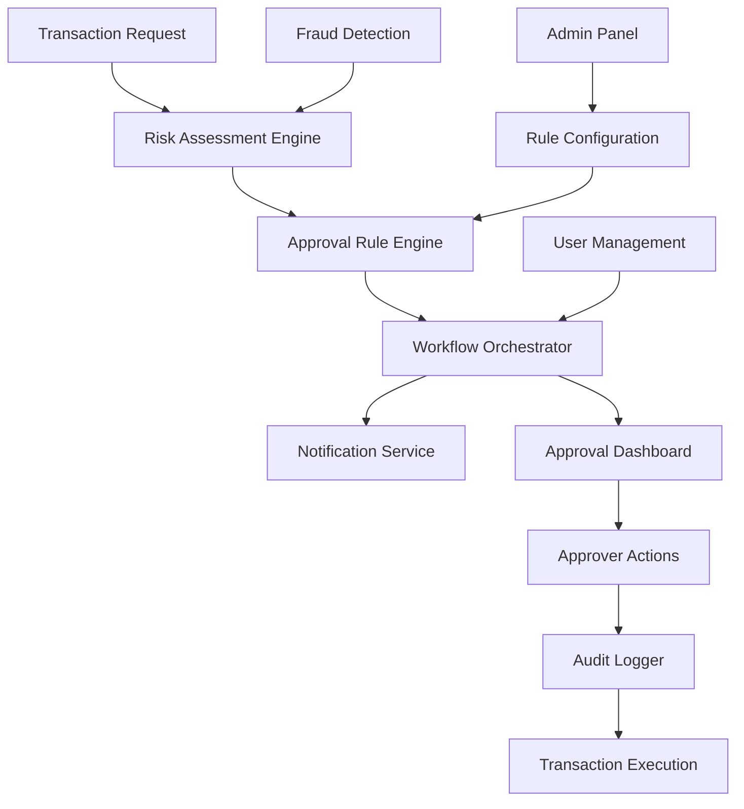

# Approval System - Design Document

## Overview

The Approval System is a comprehensive workflow engine that manages multi-level authorization for financial transactions in FinBot v4. It integrates with the existing role-based access control system and provides configurable approval rules, real-time notifications, audit trails, and risk assessment capabilities.

## Architecture

### High-Level Architecture



### System Components

#### 1. Approval Rule Engine
- **Purpose:** Evaluates transactions against configured rules
- **Input:** Transaction details, user context, risk score
- **Output:** Required approval levels, assigned approvers
- **Technology:** Node.js service with PostgreSQL rule storage

#### 2. Workflow Orchestrator
- **Purpose:** Manages approval workflow state and transitions
- **Features:** Parallel/sequential approvals, escalation, delegation
- **Technology:** State machine pattern with Redis for state storage
- **Integration:** WebSocket for real-time updates

#### 3. Risk Assessment Engine
- **Purpose:** Calculates risk scores and detects suspicious patterns
- **Features:** ML-based fraud detection, pattern analysis
- **Technology:** Python microservice with scikit-learn
- **Data Sources:** Transaction history, user behavior, external APIs

#### 4. Notification Service
- **Purpose:** Sends notifications via multiple channels
- **Channels:** Email, SMS, in-app notifications, Slack/Teams
- **Technology:** Queue-based system with Redis/Bull
- **Templates:** Configurable notification templates

## Components and Interfaces

### Database Schema

#### Approval Rules Table
```sql
CREATE TABLE approval_rules (
    id UUID PRIMARY KEY DEFAULT gen_random_uuid(),
    name VARCHAR(255) NOT NULL,
    transaction_type VARCHAR(100) NOT NULL,
    amount_threshold DECIMAL(15,2),
    currency VARCHAR(3) DEFAULT 'TRY',
    approval_levels INTEGER NOT NULL DEFAULT 1,
    required_roles JSONB, -- Array of roles for each level
    conditions JSONB, -- Additional conditions (time, location, etc.)
    is_active BOOLEAN DEFAULT true,
    created_by UUID REFERENCES users(id),
    created_at TIMESTAMP DEFAULT NOW(),
    updated_at TIMESTAMP DEFAULT NOW()
);
```

#### Approval Workflows Table
```sql
CREATE TABLE approval_workflows (
    id UUID PRIMARY KEY DEFAULT gen_random_uuid(),
    transaction_id UUID NOT NULL,
    rule_id UUID REFERENCES approval_rules(id),
    requester_id UUID REFERENCES users(id),
    current_level INTEGER DEFAULT 1,
    total_levels INTEGER NOT NULL,
    status VARCHAR(50) DEFAULT 'pending', -- pending, approved, rejected, cancelled
    risk_score DECIMAL(5,2),
    emergency_override BOOLEAN DEFAULT false,
    created_at TIMESTAMP DEFAULT NOW(),
    completed_at TIMESTAMP,
    metadata JSONB -- Additional workflow data
);
```

#### Approval Actions Table
```sql
CREATE TABLE approval_actions (
    id UUID PRIMARY KEY DEFAULT gen_random_uuid(),
    workflow_id UUID REFERENCES approval_workflows(id),
    approver_id UUID REFERENCES users(id),
    level INTEGER NOT NULL,
    action VARCHAR(20) NOT NULL, -- approve, reject, delegate, escalate
    comments TEXT,
    delegated_to UUID REFERENCES users(id),
    created_at TIMESTAMP DEFAULT NOW(),
    ip_address INET,
    user_agent TEXT
);
```

#### Risk Assessments Table
```sql
CREATE TABLE risk_assessments (
    id UUID PRIMARY KEY DEFAULT gen_random_uuid(),
    transaction_id UUID NOT NULL,
    risk_score DECIMAL(5,2) NOT NULL,
    risk_factors JSONB, -- Detailed risk breakdown
    fraud_indicators JSONB, -- Detected fraud patterns
    assessment_method VARCHAR(50), -- rule_based, ml_model, hybrid
    created_at TIMESTAMP DEFAULT NOW()
);
```

### API Interfaces

#### Approval Workflow API

```typescript
// Create approval workflow
POST /api/approvals/workflows
{
  transactionId: string;
  transactionType: string;
  amount: number;
  currency: string;
  metadata?: Record<string, any>;
}

// Get pending approvals for user
GET /api/approvals/pending?userId={userId}&page={page}&limit={limit}

// Approve/Reject workflow
POST /api/approvals/workflows/{workflowId}/actions
{
  action: 'approve' | 'reject' | 'delegate' | 'escalate';
  comments?: string;
  delegatedTo?: string;
}

// Get workflow status
GET /api/approvals/workflows/{workflowId}/status

// Emergency override (admin only)
POST /api/approvals/workflows/{workflowId}/override
{
  reason: string;
  justification: string;
}
```

#### Rule Configuration API

```typescript
// Create/Update approval rule
POST /api/approvals/rules
PUT /api/approvals/rules/{ruleId}
{
  name: string;
  transactionType: string;
  amountThreshold: number;
  currency: string;
  approvalLevels: number;
  requiredRoles: string[][];
  conditions?: Record<string, any>;
}

// Get approval rules
GET /api/approvals/rules?type={type}&active={boolean}

// Test rule against transaction
POST /api/approvals/rules/test
{
  transactionType: string;
  amount: number;
  currency: string;
  userId: string;
}
```

### Frontend Components

#### ApprovalDashboard Component
```typescript
interface ApprovalDashboardProps {
  userId: string;
  role: UserRole;
}

interface PendingApproval {
  workflowId: string;
  transactionId: string;
  requester: User;
  amount: number;
  currency: string;
  riskScore: number;
  currentLevel: number;
  totalLevels: number;
  createdAt: Date;
  urgency: 'low' | 'medium' | 'high' | 'critical';
}
```

#### ApprovalForm Component
```typescript
interface ApprovalFormProps {
  workflow: ApprovalWorkflow;
  onSubmit: (action: ApprovalAction) => void;
  canDelegate: boolean;
  canEscalate: boolean;
}

interface ApprovalAction {
  action: 'approve' | 'reject' | 'delegate' | 'escalate';
  comments: string;
  delegatedTo?: string;
}
```

## Data Models

### Core Domain Models

```typescript
interface ApprovalRule {
  id: string;
  name: string;
  transactionType: TransactionType;
  amountThreshold: number;
  currency: Currency;
  approvalLevels: number;
  requiredRoles: UserRole[][];
  conditions: RuleCondition[];
  isActive: boolean;
  createdBy: string;
  createdAt: Date;
  updatedAt: Date;
}

interface ApprovalWorkflow {
  id: string;
  transactionId: string;
  ruleId: string;
  requesterId: string;
  currentLevel: number;
  totalLevels: number;
  status: WorkflowStatus;
  riskScore: number;
  emergencyOverride: boolean;
  actions: ApprovalAction[];
  createdAt: Date;
  completedAt?: Date;
  metadata: Record<string, any>;
}

interface RiskAssessment {
  id: string;
  transactionId: string;
  riskScore: number;
  riskFactors: RiskFactor[];
  fraudIndicators: FraudIndicator[];
  assessmentMethod: 'rule_based' | 'ml_model' | 'hybrid';
  createdAt: Date;
}

enum WorkflowStatus {
  PENDING = 'pending',
  APPROVED = 'approved',
  REJECTED = 'rejected',
  CANCELLED = 'cancelled',
  ESCALATED = 'escalated'
}

enum TransactionType {
  TRANSFER = 'transfer',
  PAYMENT = 'payment',
  WITHDRAWAL = 'withdrawal',
  INVESTMENT = 'investment',
  LOAN = 'loan'
}
```

## Error Handling

### Error Types and Responses

```typescript
enum ApprovalErrorCode {
  WORKFLOW_NOT_FOUND = 'WORKFLOW_NOT_FOUND',
  INSUFFICIENT_PERMISSIONS = 'INSUFFICIENT_PERMISSIONS',
  INVALID_APPROVAL_LEVEL = 'INVALID_APPROVAL_LEVEL',
  WORKFLOW_ALREADY_COMPLETED = 'WORKFLOW_ALREADY_COMPLETED',
  RULE_VALIDATION_FAILED = 'RULE_VALIDATION_FAILED',
  RISK_THRESHOLD_EXCEEDED = 'RISK_THRESHOLD_EXCEEDED',
  FRAUD_DETECTED = 'FRAUD_DETECTED'
}

interface ApprovalError {
  code: ApprovalErrorCode;
  message: string;
  details: Record<string, any>;
  traceId: string;
  timestamp: Date;
}
```

### Error Handling Strategy

1. **Validation Errors:** Return 400 with detailed field-level errors
2. **Authorization Errors:** Return 403 with required permissions
3. **Workflow Errors:** Return 409 with current workflow state
4. **System Errors:** Return 500 with trace ID for debugging
5. **Fraud Detection:** Return 423 (Locked) with security review required

## Testing Strategy

### Unit Tests
- **Rule Engine:** Test rule evaluation logic with various scenarios
- **Workflow Orchestrator:** Test state transitions and business logic
- **Risk Assessment:** Test scoring algorithms and fraud detection
- **API Endpoints:** Test request/response handling and validation

### Integration Tests
- **Database Operations:** Test CRUD operations and transactions
- **Notification Service:** Test email/SMS delivery and templates
- **External APIs:** Test fraud detection service integration
- **WebSocket Events:** Test real-time notification delivery

### End-to-End Tests
- **Complete Approval Flow:** Test full workflow from request to execution
- **Multi-level Approvals:** Test complex approval hierarchies
- **Emergency Override:** Test admin override functionality
- **Fraud Detection:** Test suspicious transaction handling

### Performance Tests
- **Concurrent Workflows:** Test system under high approval load
- **Rule Evaluation:** Test performance with complex rule sets
- **Database Queries:** Test query performance with large datasets
- **Notification Throughput:** Test notification service scalability

## Security Considerations

### Authentication & Authorization
- **JWT Tokens:** Secure API access with role-based permissions
- **Multi-Factor Authentication:** Required for high-value approvals
- **Session Management:** Secure session handling with timeout
- **API Rate Limiting:** Prevent abuse and DoS attacks

### Data Protection
- **Encryption:** Encrypt sensitive data at rest and in transit
- **PII Handling:** Mask personal information in logs and exports
- **Audit Trails:** Immutable audit logs with digital signatures
- **Data Retention:** Automatic archival based on compliance requirements

### Fraud Prevention
- **Behavioral Analysis:** Monitor user patterns for anomalies
- **IP Geolocation:** Flag transactions from unusual locations
- **Device Fingerprinting:** Track device characteristics
- **Velocity Checks:** Monitor transaction frequency and amounts

## Deployment Architecture

### Microservices Deployment

```yaml
# docker-compose.yml
version: '3.8'
services:
  approval-api:
    image: finbot/approval-api:latest
    environment:
      - DATABASE_URL=${DATABASE_URL}
      - REDIS_URL=${REDIS_URL}
      - JWT_SECRET=${JWT_SECRET}
    depends_on:
      - postgres
      - redis

  risk-engine:
    image: finbot/risk-engine:latest
    environment:
      - ML_MODEL_PATH=/models/fraud_detection.pkl
      - API_KEY=${RISK_API_KEY}

  notification-service:
    image: finbot/notification-service:latest
    environment:
      - SMTP_HOST=${SMTP_HOST}
      - SMS_API_KEY=${SMS_API_KEY}
      - SLACK_WEBHOOK=${SLACK_WEBHOOK}

  postgres:
    image: postgres:15
    environment:
      - POSTGRES_DB=finbot_approvals
      - POSTGRES_USER=${DB_USER}
      - POSTGRES_PASSWORD=${DB_PASSWORD}

  redis:
    image: redis:7-alpine
    command: redis-server --appendonly yes
```

### Monitoring & Observability

- **Application Metrics:** Response times, error rates, throughput
- **Business Metrics:** Approval rates, processing times, fraud detection
- **Infrastructure Metrics:** CPU, memory, disk, network usage
- **Alerting:** Real-time alerts for system issues and security events

## Performance Optimization

### Caching Strategy
- **Rule Cache:** Cache frequently used approval rules in Redis
- **User Cache:** Cache user roles and permissions
- **Workflow State:** Cache active workflow states for quick access
- **Risk Scores:** Cache risk assessment results for similar transactions

### Database Optimization
- **Indexing:** Optimize queries with proper database indexes
- **Partitioning:** Partition large tables by date or tenant
- **Connection Pooling:** Efficient database connection management
- **Read Replicas:** Use read replicas for reporting and analytics

### Scalability Considerations
- **Horizontal Scaling:** Scale approval services based on load
- **Load Balancing:** Distribute requests across multiple instances
- **Queue Management:** Use message queues for async processing
- **Circuit Breakers:** Prevent cascade failures in microservices