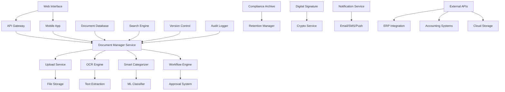

# Document Management System - Design Document

## Overview

The Document Management System is a comprehensive platform for digitizing, processing, and managing financial documents with AI-powered OCR, intelligent categorization, and compliance-ready archiving. The system integrates advanced machine learning for data extraction, automated workflows for document processing, and enterprise-grade security for sensitive financial information.

## Architecture

### High-Level Architecture



### System Components

#### 1. Document Manager Service
- **Purpose:** Core business logic for document operations
- **Components:**
  - Document CRUD Operations
  - Metadata Management
  - Access Control
  - Integration Orchestrator
- **Technology:** Node.js, TypeScript, Express
- **Features:** RESTful APIs, GraphQL, real-time updates

#### 2. OCR Engine
- **Purpose:** Optical Character Recognition and data extraction
- **Components:**
  - Text Recognition Service
  - Data Extraction Engine
  - Confidence Scoring
  - Quality Enhancement
- **Technology:** Tesseract, Google Vision API, AWS Textract
- **Features:** Multi-language support, handwriting recognition

#### 3. Smart Categorizer
- **Purpose:** AI-powered document classification and organization
- **Components:**
  - ML Classification Models
  - Rule-based Categorizer
  - Custom Category Manager
  - Learning Engine
- **Technology:** TensorFlow, scikit-learn, NLTK
- **Features:** Auto-categorization, custom rules, continuous learning

#### 4. Workflow Engine
- **Purpose:** Document approval and processing workflows
- **Components:**
  - Workflow Designer
  - State Machine
  - Task Manager
  - Notification Router
- **Technology:** Camunda, Node.js, Redis
- **Features:** Visual workflow design, parallel processing

## Components and Interfaces

### Data Models

#### Core Document Models

```typescript
interface Document {
  id: string;
  userId: string;
  filename: string;
  originalName: string;
  mimeType: string;
  size: number;
  category: DocumentCategory;
  subcategory?: string;
  tags: string[];
  metadata: DocumentMetadata;
  extractedData: ExtractedData;
  status: DocumentStatus;
  version: number;
  parentId?: string;
  createdAt: Date;
  updatedAt: Date;
  archivedAt?: Date;
}

interface DocumentMetadata {
  title?: string;
  description?: string;
  author?: string;
  subject?: string;
  keywords: string[];
  customFields: Record<string, any>;
  ocrConfidence?: number;
  processingStatus: ProcessingStatus;
  retentionPolicy?: RetentionPolicy;
}

interface ExtractedData {
  fullText: string;
  entities: ExtractedEntity[];
  financialData: FinancialData;
  structuredData: Record<string, any>;
  confidence: number;
  extractionMethod: ExtractionMethod;
  reviewRequired: boolean;
}

interface ExtractedEntity {
  type: EntityType;
  value: string;
  confidence: number;
  position: TextPosition;
  verified: boolean;
}

interface FinancialData {
  amount?: number;
  currency?: string;
  date?: Date;
  vendor?: string;
  invoiceNumber?: string;
  taxAmount?: number;
  lineItems?: LineItem[];
  paymentTerms?: string;
}

interface DocumentWorkflow {
  id: string;
  documentId: string;
  workflowType: WorkflowType;
  currentStep: string;
  status: WorkflowStatus;
  assignedTo: string[];
  dueDate?: Date;
  priority: Priority;
  steps: WorkflowStep[];
  history: WorkflowHistory[];
  createdAt: Date;
  completedAt?: Date;
}

interface WorkflowStep {
  id: string;
  name: string;
  type: StepType;
  assigneeRole: string;
  assigneeUsers?: string[];
  conditions: StepCondition[];
  actions: StepAction[];
  timeoutHours?: number;
  required: boolean;
}

interface DocumentVersion {
  id: string;
  documentId: string;
  version: number;
  changes: VersionChange[];
  createdBy: string;
  createdAt: Date;
  comment?: string;
  fileHash: string;
  size: number;
}

interface ComplianceRecord {
  id: string;
  documentId: string;
  retentionPolicy: RetentionPolicy;
  legalHold: boolean;
  retentionDate: Date;
  destructionDate?: Date;
  complianceStatus: ComplianceStatus;
  auditTrail: AuditEntry[];
  jurisdiction: string;
  regulatoryRequirements: string[];
}

enum DocumentCategory {
  INVOICE = 'invoice',
  RECEIPT = 'receipt',
  CONTRACT = 'contract',
  BANK_STATEMENT = 'bank_statement',
  TAX_DOCUMENT = 'tax_document',
  INSURANCE = 'insurance',
  LEGAL = 'legal',
  OTHER = 'other'
}

enum DocumentStatus {
  UPLOADING = 'uploading',
  PROCESSING = 'processing',
  REVIEW_REQUIRED = 'review_required',
  APPROVED = 'approved',
  REJECTED = 'rejected',
  ARCHIVED = 'archived'
}

enum WorkflowType {
  APPROVAL = 'approval',
  REVIEW = 'review',
  PROCESSING = 'processing',
  COMPLIANCE = 'compliance'
}
```

### API Interfaces

#### Document Management API

```typescript
// Upload document
POST /api/documents/upload
Content-Type: multipart/form-data
Request: {
  file: File;
  category?: string;
  tags?: string[];
  metadata?: DocumentMetadata;
}
Response: {
  documentId: string;
  status: 'uploaded' | 'processing';
  estimatedProcessingTime: number;
}

// Get document details
GET /api/documents/{documentId}
Response: {
  document: Document;
  extractedData: ExtractedData;
  workflow?: DocumentWorkflow;
  versions: DocumentVersion[];
}

// Search documents
GET /api/documents/search?q={query}&category={category}&tags={tags}&dateFrom={date}&dateTo={date}
Response: {
  documents: Document[];
  totalCount: number;
  facets: SearchFacets;
  suggestions: string[];
}

// Update document
PUT /api/documents/{documentId}
Request: {
  metadata?: DocumentMetadata;
  category?: string;
  tags?: string[];
  extractedData?: ExtractedData;
}
Response: {
  document: Document;
  version: number;
}

// Delete document
DELETE /api/documents/{documentId}
Response: {
  success: boolean;
  message: string;
}
```

#### OCR and Data Extraction API

```typescript
// Extract data from document
POST /api/ocr/extract
Request: {
  documentId: string;
  extractionType: 'full' | 'financial' | 'entities';
  language?: string;
  enhanceImage?: boolean;
}
Response: {
  extractedData: ExtractedData;
  confidence: number;
  processingTime: number;
  reviewRequired: boolean;
}

// Verify extracted data
POST /api/ocr/verify
Request: {
  documentId: string;
  extractedData: ExtractedData;
  corrections: DataCorrection[];
}
Response: {
  verifiedData: ExtractedData;
  learningFeedback: boolean;
}

// Get OCR status
GET /api/ocr/status/{documentId}
Response: {
  status: 'queued' | 'processing' | 'completed' | 'failed';
  progress: number;
  estimatedCompletion: Date;
  error?: string;
}
```

#### Workflow Management API

```typescript
// Create workflow
POST /api/workflows
Request: {
  documentId: string;
  workflowType: WorkflowType;
  assignees: string[];
  dueDate?: Date;
  priority: Priority;
  customSteps?: WorkflowStep[];
}
Response: {
  workflowId: string;
  status: WorkflowStatus;
  nextStep: WorkflowStep;
}

// Process workflow step
POST /api/workflows/{workflowId}/steps/{stepId}/process
Request: {
  action: 'approve' | 'reject' | 'request_changes';
  comments?: string;
  attachments?: string[];
}
Response: {
  workflow: DocumentWorkflow;
  nextStep?: WorkflowStep;
  completed: boolean;
}

// Get workflow status
GET /api/workflows/{workflowId}
Response: {
  workflow: DocumentWorkflow;
  document: Document;
  currentAssignees: User[];
  history: WorkflowHistory[];
}
```

### Database Schema

#### Document Tables

```sql
-- Documents table
CREATE TABLE documents (
    id UUID PRIMARY KEY DEFAULT gen_random_uuid(),
    user_id UUID NOT NULL REFERENCES users(id),
    filename VARCHAR(255) NOT NULL,
    original_name VARCHAR(255) NOT NULL,
    mime_type VARCHAR(100) NOT NULL,
    size BIGINT NOT NULL,
    category VARCHAR(50) NOT NULL,
    subcategory VARCHAR(100),
    tags TEXT[],
    metadata JSONB,
    extracted_data JSONB,
    status VARCHAR(20) NOT NULL DEFAULT 'uploading',
    version INTEGER NOT NULL DEFAULT 1,
    parent_id UUID REFERENCES documents(id),
    file_hash VARCHAR(64),
    storage_path TEXT NOT NULL,
    created_at TIMESTAMP DEFAULT NOW(),
    updated_at TIMESTAMP DEFAULT NOW(),
    archived_at TIMESTAMP
);

-- Document versions
CREATE TABLE document_versions (
    id UUID PRIMARY KEY DEFAULT gen_random_uuid(),
    document_id UUID NOT NULL REFERENCES documents(id),
    version INTEGER NOT NULL,
    changes JSONB,
    created_by UUID NOT NULL REFERENCES users(id),
    created_at TIMESTAMP DEFAULT NOW(),
    comment TEXT,
    file_hash VARCHAR(64) NOT NULL,
    size BIGINT NOT NULL,
    storage_path TEXT NOT NULL
);

-- Document workflows
CREATE TABLE document_workflows (
    id UUID PRIMARY KEY DEFAULT gen_random_uuid(),
    document_id UUID NOT NULL REFERENCES documents(id),
    workflow_type VARCHAR(50) NOT NULL,
    current_step VARCHAR(100),
    status VARCHAR(20) NOT NULL DEFAULT 'active',
    assigned_to UUID[],
    due_date TIMESTAMP,
    priority VARCHAR(20) DEFAULT 'medium',
    steps JSONB NOT NULL,
    history JSONB DEFAULT '[]',
    created_at TIMESTAMP DEFAULT NOW(),
    completed_at TIMESTAMP
);

-- OCR processing queue
CREATE TABLE ocr_queue (
    id UUID PRIMARY KEY DEFAULT gen_random_uuid(),
    document_id UUID NOT NULL REFERENCES documents(id),
    status VARCHAR(20) NOT NULL DEFAULT 'queued',
    priority INTEGER DEFAULT 5,
    extraction_type VARCHAR(20) NOT NULL,
    language VARCHAR(10) DEFAULT 'en',
    enhance_image BOOLEAN DEFAULT false,
    started_at TIMESTAMP,
    completed_at TIMESTAMP,
    error_message TEXT,
    retry_count INTEGER DEFAULT 0,
    created_at TIMESTAMP DEFAULT NOW()
);

-- Document sharing
CREATE TABLE document_shares (
    id UUID PRIMARY KEY DEFAULT gen_random_uuid(),
    document_id UUID NOT NULL REFERENCES documents(id),
    shared_by UUID NOT NULL REFERENCES users(id),
    shared_with UUID REFERENCES users(id),
    share_token VARCHAR(255),
    permissions JSONB NOT NULL,
    expires_at TIMESTAMP,
    access_count INTEGER DEFAULT 0,
    last_accessed TIMESTAMP,
    created_at TIMESTAMP DEFAULT NOW()
);

-- Compliance records
CREATE TABLE compliance_records (
    id UUID PRIMARY KEY DEFAULT gen_random_uuid(),
    document_id UUID NOT NULL REFERENCES documents(id),
    retention_policy JSONB NOT NULL,
    legal_hold BOOLEAN DEFAULT false,
    retention_date TIMESTAMP NOT NULL,
    destruction_date TIMESTAMP,
    compliance_status VARCHAR(20) NOT NULL,
    jurisdiction VARCHAR(10) NOT NULL,
    regulatory_requirements TEXT[],
    audit_trail JSONB DEFAULT '[]',
    created_at TIMESTAMP DEFAULT NOW(),
    updated_at TIMESTAMP DEFAULT NOW()
);

-- Full-text search indexes
CREATE INDEX idx_documents_fulltext ON documents USING gin(to_tsvector('english', 
    coalesce(metadata->>'title', '') || ' ' || 
    coalesce(metadata->>'description', '') || ' ' || 
    coalesce(extracted_data->>'fullText', '')
));

-- Performance indexes
CREATE INDEX idx_documents_user_category ON documents(user_id, category);
CREATE INDEX idx_documents_status ON documents(status);
CREATE INDEX idx_documents_created_at ON documents(created_at);
CREATE INDEX idx_document_workflows_status ON document_workflows(status);
CREATE INDEX idx_ocr_queue_status_priority ON ocr_queue(status, priority);
```

### Frontend Components

#### Document Management Interface

```typescript
interface DocumentManagerProps {
  userId: string;
  onDocumentSelect: (document: Document) => void;
  onUpload: (files: File[]) => void;
}

interface DocumentUploadWidget {
  acceptedTypes: string[];
  maxFileSize: number;
  onUpload: (files: File[], metadata: DocumentMetadata) => void;
  onProgress: (progress: UploadProgress) => void;
}

interface DocumentViewer {
  document: Document;
  showAnnotations: boolean;
  allowEdit: boolean;
  onAnnotate: (annotation: Annotation) => void;
  onExtractedDataEdit: (data: ExtractedData) => void;
}

interface OCRResultsPanel {
  extractedData: ExtractedData;
  confidence: number;
  onVerify: (corrections: DataCorrection[]) => void;
  onReprocess: () => void;
}

interface WorkflowPanel {
  workflow: DocumentWorkflow;
  currentUser: User;
  onAction: (action: WorkflowAction) => void;
  onComment: (comment: string) => void;
}

interface DocumentSearch {
  onSearch: (query: SearchQuery) => void;
  filters: SearchFilter[];
  results: SearchResult[];
  facets: SearchFacets;
}
```

## Error Handling

### Document Processing Errors

```typescript
enum DocumentErrorCode {
  UNSUPPORTED_FORMAT = 'UNSUPPORTED_FORMAT',
  FILE_TOO_LARGE = 'FILE_TOO_LARGE',
  OCR_FAILED = 'OCR_FAILED',
  EXTRACTION_FAILED = 'EXTRACTION_FAILED',
  WORKFLOW_ERROR = 'WORKFLOW_ERROR',
  PERMISSION_DENIED = 'PERMISSION_DENIED',
  STORAGE_ERROR = 'STORAGE_ERROR',
  COMPLIANCE_VIOLATION = 'COMPLIANCE_VIOLATION'
}

interface DocumentError {
  code: DocumentErrorCode;
  message: string;
  details: {
    documentId?: string;
    filename?: string;
    stage?: ProcessingStage;
    retryable?: boolean;
  };
  suggestions: string[];
}

interface ProcessingFallback {
  type: 'manual_review' | 'alternative_ocr' | 'skip_extraction';
  description: string;
  estimatedTime?: number;
  cost?: number;
}
```

## Testing Strategy

### Document Processing Testing

#### Unit Tests
- **OCR Engine:** Test text extraction accuracy with various document types
- **Categorization:** Test ML model accuracy with labeled datasets
- **Data Extraction:** Test financial data parsing with sample documents
- **Workflow Engine:** Test state transitions and business rules

#### Integration Tests
- **End-to-End Processing:** Test complete document lifecycle from upload to archive
- **API Integration:** Test all REST endpoints with various document types
- **Storage Integration:** Test file storage and retrieval operations
- **External Services:** Test OCR provider integrations and failover

#### Performance Tests
- **Upload Performance:** Test concurrent file uploads and processing
- **OCR Performance:** Test processing speed with various document sizes
- **Search Performance:** Test full-text search with large document collections
- **Workflow Performance:** Test complex workflow execution under load

### Compliance Testing

#### Retention Testing
- **Policy Enforcement:** Test automatic retention policy application
- **Deletion Testing:** Test secure document deletion after retention period
- **Legal Hold:** Test legal hold application and removal
- **Audit Trail:** Test comprehensive audit logging

#### Security Testing
- **Access Control:** Test document permission enforcement
- **Encryption:** Test document encryption at rest and in transit
- **Digital Signatures:** Test signature creation and verification
- **Data Privacy:** Test PII detection and protection

## Security and Compliance

### Document Security

#### Encryption and Storage
- **At-Rest Encryption:** AES-256 encryption for stored documents
- **In-Transit Encryption:** TLS 1.3 for all document transfers
- **Key Management:** Hardware Security Module (HSM) for key storage
- **Access Logging:** Comprehensive access audit trails

#### Access Control
- **Role-Based Access:** Granular permissions based on user roles
- **Document-Level Security:** Individual document access controls
- **Time-Based Access:** Temporary access with automatic expiration
- **IP Restrictions:** Location-based access controls

### Regulatory Compliance

#### Retention Management
- **Automated Policies:** Rule-based retention policy application
- **Legal Hold:** Litigation hold management with audit trails
- **Secure Deletion:** Cryptographic erasure for expired documents
- **Compliance Reporting:** Automated compliance status reporting

#### Industry Standards
- **SOX Compliance:** Sarbanes-Oxley document retention requirements
- **GDPR Compliance:** EU data protection regulation compliance
- **HIPAA Compliance:** Healthcare document security requirements
- **ISO 27001:** Information security management standards

## Deployment Architecture

### Microservices Deployment

```yaml
# Document Manager Service
apiVersion: apps/v1
kind: Deployment
metadata:
  name: document-manager
  namespace: finbot-production
spec:
  replicas: 3
  selector:
    matchLabels:
      app: document-manager
  template:
    metadata:
      labels:
        app: document-manager
    spec:
      containers:
      - name: document-manager
        image: finbot/document-manager:latest
        env:
        - name: DATABASE_URL
          valueFrom:
            secretKeyRef:
              name: document-db-secret
              key: connection-string
        - name: STORAGE_BACKEND
          value: "s3"
        - name: OCR_PROVIDER
          value: "google-vision"
        - name: ELASTICSEARCH_URL
          value: "elasticsearch.search.svc.cluster.local:9200"
        resources:
          requests:
            cpu: 500m
            memory: 1Gi
          limits:
            cpu: 2000m
            memory: 4Gi
        volumeMounts:
        - name: temp-storage
          mountPath: /tmp
      volumes:
      - name: temp-storage
        emptyDir:
          sizeLimit: 10Gi
```

### Storage Architecture

#### Multi-Tier Storage
- **Hot Storage:** SSD storage for frequently accessed documents
- **Warm Storage:** Standard storage for regular access documents
- **Cold Storage:** Archive storage for compliance and backup
- **Glacier Storage:** Long-term retention for legal requirements

#### Content Delivery
- **CDN Integration:** Global content delivery for document access
- **Edge Caching:** Regional caching for improved performance
- **Compression:** Document compression for storage optimization
- **Deduplication:** Eliminate duplicate document storage

## Performance Optimization

### Document Processing Optimization

#### OCR Performance
- **Parallel Processing:** Multi-threaded OCR processing
- **GPU Acceleration:** GPU-based image processing for speed
- **Preprocessing:** Image enhancement for better OCR accuracy
- **Caching:** Cache OCR results for duplicate documents

#### Search Optimization
- **Elasticsearch:** Full-text search with advanced indexing
- **Faceted Search:** Multi-dimensional search capabilities
- **Auto-complete:** Real-time search suggestions
- **Result Ranking:** ML-based relevance scoring

### Scalability Features

#### Horizontal Scaling
- **Microservices:** Independent scaling of service components
- **Load Balancing:** Distribute processing across multiple instances
- **Queue Management:** Async processing with message queues
- **Database Sharding:** Distribute data across multiple databases

#### Performance Monitoring
- **Real-time Metrics:** Processing speed and accuracy monitoring
- **Resource Usage:** CPU, memory, and storage utilization
- **User Experience:** Response time and error rate tracking
- **Business Metrics:** Document processing volume and success rates