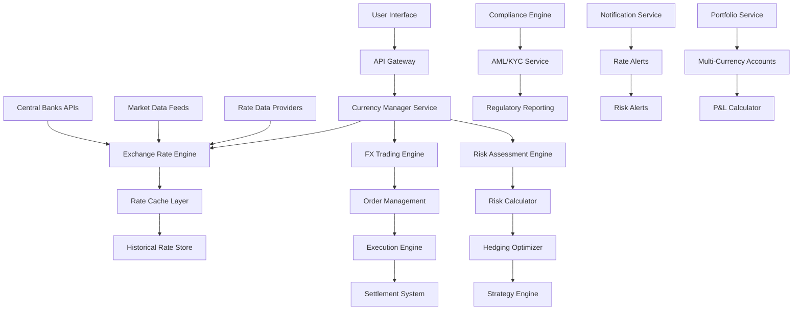

# Multi-Currency Management - Design Document

## Overview

The Multi-Currency Management system is a comprehensive financial platform that enables users to manage portfolios across 150+ currencies with real-time exchange rates, automated hedging, and advanced risk management. The system integrates with multiple FX data providers, supports complex trading operations, and provides regulatory compliance features for international transactions.

## Architecture

### High-Level Architecture



### System Components

#### 1. Exchange Rate Engine
- **Purpose:** Manages real-time and historical exchange rate data
- **Components:**
  - Rate Data Aggregator
  - Rate Validation Service
  - Historical Rate Manager
  - Rate Alert System
- **Technology:** Node.js, Redis, TimescaleDB
- **Features:** Multi-provider aggregation, rate validation, caching

#### 2. Currency Manager Service
- **Purpose:** Core business logic for multi-currency operations
- **Components:**
  - Currency Configuration
  - Conversion Service
  - Portfolio Manager
  - Transaction Processor
- **Technology:** Node.js, TypeScript, PostgreSQL
- **Features:** Currency operations, portfolio management, transaction processing

#### 3. FX Trading Engine
- **Purpose:** Handles foreign exchange trading operations
- **Components:**
  - Order Management System
  - Execution Engine
  - Settlement Service
  - Trade Reporting
- **Technology:** Java, Spring Boot, Apache Kafka
- **Features:** Order routing, execution, settlement, reporting

#### 4. Risk Assessment Engine
- **Purpose:** Calculates currency risk and provides hedging recommendations
- **Components:**
  - Risk Calculator
  - VaR Engine
  - Correlation Analyzer
  - Hedging Optimizer
- **Technology:** Python, NumPy, SciPy, TensorFlow
- **Features:** Risk metrics, hedging strategies, optimization

## Components and Interfaces

### Data Models

#### Core Currency Models

```typescript
interface Currency {
  code: string;           // ISO 4217 code (USD, EUR, etc.)
  name: string;
  symbol: string;
  decimals: number;
  isActive: boolean;
  isCrypto: boolean;
  country?: string;
  region?: string;
  majorCurrency: boolean;
  tradingHours: TradingHours;
}

interface ExchangeRate {
  id: string;
  baseCurrency: string;
  quoteCurrency: string;
  rate: number;
  bid: number;
  ask: number;
  spread: number;
  timestamp: Date;
  source: string;
  confidence: number;
  volatility?: number;
}

interface CurrencyAccount {
  id: string;
  userId: string;
  currency: string;
  balance: number;
  availableBalance: number;
  reservedBalance: number;
  accountType: AccountType;
  isActive: boolean;
  createdAt: Date;
  updatedAt: Date;
}

interface MultiCurrencyPortfolio {
  id: string;
  userId: string;
  baseCurrency: string;
  accounts: CurrencyAccount[];
  totalValueInBase: number;
  unrealizedPnL: number;
  realizedPnL: number;
  currencyExposure: CurrencyExposure[];
  riskMetrics: RiskMetrics;
  lastUpdated: Date;
}

interface FXTransaction {
  id: string;
  userId: string;
  type: FXTransactionType;
  baseCurrency: string;
  quoteCurrency: string;
  baseAmount: number;
  quoteAmount: number;
  exchangeRate: number;
  executionRate?: number;
  fees: TransactionFees;
  status: TransactionStatus;
  orderType: OrderType;
  executedAt?: Date;
  settledAt?: Date;
  metadata: Record<string, any>;
}

interface CurrencyRisk {
  userId: string;
  baseCurrency: string;
  exposures: CurrencyExposure[];
  totalRisk: number;
  var95: number;
  var99: number;
  expectedShortfall: number;
  correlationMatrix: number[][];
  riskFactors: RiskFactor[];
  hedgingRecommendations: HedgingRecommendation[];
  lastCalculated: Date;
}

interface HedgingStrategy {
  id: string;
  userId: string;
  name: string;
  type: HedgingType;
  targetCurrency: string;
  hedgeRatio: number;
  instruments: HedgingInstrument[];
  effectiveness: number;
  cost: number;
  duration: number;
  status: StrategyStatus;
  createdAt: Date;
}

enum FXTransactionType {
  SPOT = 'spot',
  FORWARD = 'forward',
  SWAP = 'swap',
  OPTION = 'option'
}

enum OrderType {
  MARKET = 'market',
  LIMIT = 'limit',
  STOP = 'stop',
  STOP_LIMIT = 'stop_limit'
}

enum HedgingType {
  FORWARD_CONTRACT = 'forward_contract',
  CURRENCY_OPTION = 'currency_option',
  CURRENCY_SWAP = 'currency_swap',
  NATURAL_HEDGE = 'natural_hedge'
}
```

### API Interfaces

#### Currency Management API

```typescript
// Get supported currencies
GET /api/currencies
Response: {
  currencies: Currency[];
  majorCurrencies: Currency[];
  cryptoCurrencies: Currency[];
}

// Get exchange rates
GET /api/exchange-rates?base={base}&quote={quote}&historical={boolean}
Response: {
  rates: ExchangeRate[];
  metadata: RateMetadata;
  lastUpdated: Date;
}

// Convert currency amounts
POST /api/currency/convert
Request: {
  fromCurrency: string;
  toCurrency: string;
  amount: number;
  rateType?: 'mid' | 'bid' | 'ask';
}
Response: {
  convertedAmount: number;
  exchangeRate: number;
  fees: ConversionFees;
  timestamp: Date;
}

// Get multi-currency portfolio
GET /api/portfolio/multi-currency?userId={userId}
Response: {
  portfolio: MultiCurrencyPortfolio;
  breakdown: CurrencyBreakdown[];
  performance: PortfolioPerformance;
}
```

#### FX Trading API

```typescript
// Place FX order
POST /api/fx/orders
Request: {
  userId: string;
  baseCurrency: string;
  quoteCurrency: string;
  amount: number;
  orderType: OrderType;
  limitRate?: number;
  stopRate?: number;
  timeInForce: TimeInForce;
}
Response: {
  orderId: string;
  status: OrderStatus;
  estimatedExecution: Date;
  fees: TradingFees;
}

// Get FX order status
GET /api/fx/orders/{orderId}
Response: {
  order: FXOrder;
  executions: OrderExecution[];
  currentMarketRate: number;
  unrealizedPnL?: number;
}

// Execute FX transaction
POST /api/fx/execute
Request: {
  orderId: string;
  executionRate?: number;
  partialFill?: boolean;
}
Response: {
  transaction: FXTransaction;
  settlement: SettlementInfo;
  updatedBalances: CurrencyAccount[];
}
```

#### Risk Management API

```typescript
// Get currency risk assessment
GET /api/risk/currency?userId={userId}
Response: {
  riskAssessment: CurrencyRisk;
  riskScore: number;
  recommendations: RiskRecommendation[];
}

// Get hedging recommendations
POST /api/risk/hedging/recommendations
Request: {
  userId: string;
  targetCurrency: string;
  hedgeRatio?: number;
  timeHorizon: number;
}
Response: {
  strategies: HedgingStrategy[];
  costBenefitAnalysis: CostBenefitAnalysis;
  riskReduction: number;
}

// Implement hedging strategy
POST /api/risk/hedging/implement
Request: {
  userId: string;
  strategyId: string;
  amount: number;
  customParameters?: Record<string, any>;
}
Response: {
  hedgeId: string;
  transactions: FXTransaction[];
  expectedEffectiveness: number;
  totalCost: number;
}
```

### Database Schema

#### Currency Tables

```sql
-- Currencies master table
CREATE TABLE currencies (
    code VARCHAR(3) PRIMARY KEY,
    name VARCHAR(100) NOT NULL,
    symbol VARCHAR(10),
    decimals INTEGER DEFAULT 2,
    is_active BOOLEAN DEFAULT true,
    is_crypto BOOLEAN DEFAULT false,
    country VARCHAR(100),
    region VARCHAR(50),
    major_currency BOOLEAN DEFAULT false,
    trading_hours JSONB,
    created_at TIMESTAMP DEFAULT NOW(),
    updated_at TIMESTAMP DEFAULT NOW()
);

-- Exchange rates (time-series data)
CREATE TABLE exchange_rates (
    id UUID PRIMARY KEY DEFAULT gen_random_uuid(),
    base_currency VARCHAR(3) NOT NULL REFERENCES currencies(code),
    quote_currency VARCHAR(3) NOT NULL REFERENCES currencies(code),
    rate DECIMAL(20,10) NOT NULL,
    bid DECIMAL(20,10),
    ask DECIMAL(20,10),
    spread DECIMAL(10,6),
    timestamp TIMESTAMP NOT NULL,
    source VARCHAR(50) NOT NULL,
    confidence DECIMAL(3,2),
    volatility DECIMAL(10,6),
    created_at TIMESTAMP DEFAULT NOW()
);

-- Create hypertable for time-series data (TimescaleDB)
SELECT create_hypertable('exchange_rates', 'timestamp');

-- Currency accounts
CREATE TABLE currency_accounts (
    id UUID PRIMARY KEY DEFAULT gen_random_uuid(),
    user_id UUID NOT NULL REFERENCES users(id),
    currency VARCHAR(3) NOT NULL REFERENCES currencies(code),
    balance DECIMAL(20,8) NOT NULL DEFAULT 0,
    available_balance DECIMAL(20,8) NOT NULL DEFAULT 0,
    reserved_balance DECIMAL(20,8) NOT NULL DEFAULT 0,
    account_type VARCHAR(20) NOT NULL,
    is_active BOOLEAN DEFAULT true,
    created_at TIMESTAMP DEFAULT NOW(),
    updated_at TIMESTAMP DEFAULT NOW()
);

-- Multi-currency portfolios
CREATE TABLE multi_currency_portfolios (
    id UUID PRIMARY KEY DEFAULT gen_random_uuid(),
    user_id UUID NOT NULL REFERENCES users(id),
    base_currency VARCHAR(3) NOT NULL REFERENCES currencies(code),
    total_value_in_base DECIMAL(20,8),
    unrealized_pnl DECIMAL(20,8) DEFAULT 0,
    realized_pnl DECIMAL(20,8) DEFAULT 0,
    currency_exposure JSONB,
    risk_metrics JSONB,
    last_updated TIMESTAMP DEFAULT NOW(),
    created_at TIMESTAMP DEFAULT NOW()
);

-- FX transactions
CREATE TABLE fx_transactions (
    id UUID PRIMARY KEY DEFAULT gen_random_uuid(),
    user_id UUID NOT NULL REFERENCES users(id),
    type VARCHAR(20) NOT NULL,
    base_currency VARCHAR(3) NOT NULL REFERENCES currencies(code),
    quote_currency VARCHAR(3) NOT NULL REFERENCES currencies(code),
    base_amount DECIMAL(20,8) NOT NULL,
    quote_amount DECIMAL(20,8) NOT NULL,
    exchange_rate DECIMAL(20,10) NOT NULL,
    execution_rate DECIMAL(20,10),
    fees JSONB,
    status VARCHAR(20) NOT NULL,
    order_type VARCHAR(20) NOT NULL,
    executed_at TIMESTAMP,
    settled_at TIMESTAMP,
    metadata JSONB,
    created_at TIMESTAMP DEFAULT NOW()
);

-- Currency risk assessments
CREATE TABLE currency_risks (
    id UUID PRIMARY KEY DEFAULT gen_random_uuid(),
    user_id UUID NOT NULL REFERENCES users(id),
    base_currency VARCHAR(3) NOT NULL REFERENCES currencies(code),
    exposures JSONB NOT NULL,
    total_risk DECIMAL(10,6),
    var_95 DECIMAL(20,8),
    var_99 DECIMAL(20,8),
    expected_shortfall DECIMAL(20,8),
    correlation_matrix JSONB,
    risk_factors JSONB,
    hedging_recommendations JSONB,
    last_calculated TIMESTAMP DEFAULT NOW(),
    created_at TIMESTAMP DEFAULT NOW()
);

-- Hedging strategies
CREATE TABLE hedging_strategies (
    id UUID PRIMARY KEY DEFAULT gen_random_uuid(),
    user_id UUID NOT NULL REFERENCES users(id),
    name VARCHAR(255) NOT NULL,
    type VARCHAR(50) NOT NULL,
    target_currency VARCHAR(3) NOT NULL REFERENCES currencies(code),
    hedge_ratio DECIMAL(5,4),
    instruments JSONB,
    effectiveness DECIMAL(5,4),
    cost DECIMAL(20,8),
    duration INTEGER, -- in days
    status VARCHAR(20) DEFAULT 'active',
    created_at TIMESTAMP DEFAULT NOW(),
    expires_at TIMESTAMP
);
```

### Frontend Components

#### Multi-Currency Dashboard

```typescript
interface MultiCurrencyDashboardProps {
  userId: string;
  baseCurrency: string;
  onCurrencyChange: (currency: string) => void;
}

interface CurrencyPortfolioWidget {
  portfolio: MultiCurrencyPortfolio;
  showPnL: boolean;
  onAccountClick: (account: CurrencyAccount) => void;
}

interface ExchangeRateWidget {
  currencyPairs: string[];
  showChart: boolean;
  alertThresholds: RateAlert[];
  onRateAlert: (alert: RateAlert) => void;
}

interface FXTradingInterface {
  availableBalances: CurrencyAccount[];
  marketRates: ExchangeRate[];
  onTradeExecute: (trade: FXTradeRequest) => void;
  onOrderPlace: (order: FXOrderRequest) => void;
}

interface RiskManagementPanel {
  riskAssessment: CurrencyRisk;
  hedgingStrategies: HedgingStrategy[];
  onHedgeImplement: (strategy: HedgingStrategy) => void;
}
```

## Error Handling

### Currency-Specific Errors

```typescript
enum CurrencyErrorCode {
  UNSUPPORTED_CURRENCY = 'UNSUPPORTED_CURRENCY',
  RATE_UNAVAILABLE = 'RATE_UNAVAILABLE',
  INSUFFICIENT_BALANCE = 'INSUFFICIENT_BALANCE',
  TRADING_HOURS_CLOSED = 'TRADING_HOURS_CLOSED',
  RATE_STALE = 'RATE_STALE',
  CONVERSION_FAILED = 'CONVERSION_FAILED',
  REGULATORY_RESTRICTION = 'REGULATORY_RESTRICTION',
  SETTLEMENT_FAILED = 'SETTLEMENT_FAILED'
}

interface CurrencyError {
  code: CurrencyErrorCode;
  message: string;
  details: {
    currency?: string;
    rate?: number;
    timestamp?: Date;
    restriction?: string;
  };
  fallbackOptions?: FallbackOption[];
}

interface FallbackOption {
  type: 'cached_rate' | 'alternative_provider' | 'manual_rate';
  description: string;
  confidence: number;
  cost?: number;
}
```

## Testing Strategy

### Currency System Testing

#### Unit Tests
- **Rate Conversion:** Test currency conversion accuracy with various rates
- **Portfolio Calculation:** Test multi-currency portfolio valuation
- **Risk Metrics:** Test VaR and risk calculation algorithms
- **Fee Calculation:** Test trading and conversion fee calculations

#### Integration Tests
- **Rate Provider Integration:** Test multiple FX data provider connections
- **Trading System Integration:** Test order execution and settlement
- **Risk System Integration:** Test hedging strategy implementation
- **Compliance Integration:** Test regulatory reporting and validation

#### End-to-End Tests
- **Multi-Currency Workflow:** Test complete user journey across currencies
- **FX Trading Flow:** Test order placement to settlement
- **Risk Management Flow:** Test risk assessment to hedging implementation
- **Compliance Flow:** Test international transfer with regulatory checks

### Performance Tests
- **Rate Update Performance:** Test real-time rate processing under load
- **Conversion Performance:** Test high-volume currency conversions
- **Portfolio Calculation:** Test large portfolio valuation performance
- **Risk Calculation:** Test complex risk metric calculations

## Security and Compliance

### Financial Regulations

#### AML/KYC Compliance
- **Transaction Monitoring:** Monitor for suspicious FX activity patterns
- **Customer Due Diligence:** Enhanced KYC for high-value FX transactions
- **Sanctions Screening:** Check transactions against sanctions lists
- **Reporting:** Automated suspicious activity reporting

#### Regulatory Compliance
- **MiFID II:** European investment services regulation compliance
- **Dodd-Frank:** US derivatives regulation compliance
- **Basel III:** Capital adequacy and risk management compliance
- **Local Regulations:** Country-specific FX regulation compliance

### Data Security
- **Rate Data Protection:** Secure handling of proprietary rate data
- **Transaction Encryption:** End-to-end encryption for FX transactions
- **PII Protection:** Secure handling of customer financial data
- **Audit Trails:** Comprehensive logging for regulatory audits

## Deployment Architecture

### Multi-Region Deployment

```yaml
# Currency Service Deployment
apiVersion: apps/v1
kind: Deployment
metadata:
  name: currency-manager
  namespace: finbot-production
spec:
  replicas: 5
  selector:
    matchLabels:
      app: currency-manager
  template:
    metadata:
      labels:
        app: currency-manager
    spec:
      containers:
      - name: currency-manager
        image: finbot/currency-manager:latest
        env:
        - name: RATE_PROVIDERS
          value: "reuters,bloomberg,fxcm,oanda"
        - name: BASE_CURRENCIES
          value: "USD,EUR,GBP,JPY,CHF,CAD,AUD"
        - name: REDIS_CLUSTER
          value: "redis-cluster.cache.svc.cluster.local:6379"
        - name: TIMESCALE_DB
          valueFrom:
            secretKeyRef:
              name: timescale-credentials
              key: connection-string
        resources:
          requests:
            cpu: 500m
            memory: 1Gi
          limits:
            cpu: 2000m
            memory: 4Gi
```

### Monitoring and Alerting

#### Currency-Specific Monitoring
- **Rate Freshness:** Monitor exchange rate update frequency
- **Conversion Accuracy:** Monitor conversion calculation accuracy
- **Trading Performance:** Monitor FX order execution performance
- **Risk Metrics:** Monitor portfolio risk metric calculations

#### Business Metrics
- **FX Volume:** Track foreign exchange transaction volumes
- **Conversion Rates:** Track currency conversion success rates
- **Risk Reduction:** Track hedging strategy effectiveness
- **User Adoption:** Track multi-currency feature usage

## Performance Optimization

### Rate Data Optimization

#### Caching Strategy
- **Multi-Level Caching:** L1 (in-memory), L2 (Redis), L3 (database)
- **Rate Interpolation:** Calculate missing rates using cross-rates
- **Predictive Caching:** Pre-cache likely requested currency pairs
- **Compression:** Compress historical rate data for storage efficiency

#### Real-Time Processing
- **Stream Processing:** Use Apache Kafka for real-time rate updates
- **Event Sourcing:** Track all rate changes for audit and replay
- **CQRS Pattern:** Separate read/write models for optimal performance
- **Circuit Breakers:** Protect against rate provider failures

### Trading System Optimization

#### Order Processing
- **Async Processing:** Non-blocking order processing pipeline
- **Batch Settlement:** Batch multiple transactions for efficiency
- **Smart Routing:** Route orders to best execution venues
- **Latency Optimization:** Minimize order-to-execution latency

#### Risk Calculation
- **Parallel Processing:** Parallelize risk metric calculations
- **Incremental Updates:** Update only changed risk factors
- **Approximation Algorithms:** Use approximations for real-time risk
- **GPU Acceleration:** Use GPUs for complex mathematical calculations