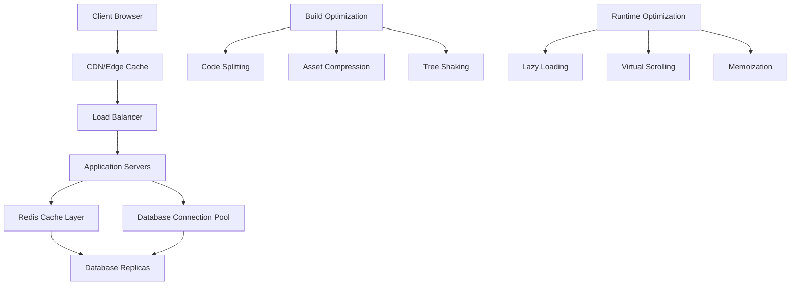

# Performance Optimization - Design Document

## Overview

FinBot v4 performance optimization focuses on reducing load times, improving API response speeds, implementing efficient caching strategies, and optimizing the overall user experience. The system will implement modern performance techniques including code splitting, lazy loading, intelligent caching, and database query optimization.

## Architecture

### High-Level Performance Architecture

## Components and Interfaces

### Frontend Optimization

#### Bundle Optimization
- **Code Splitting**: Route-based and component-based splitting
- **Tree Shaking**: Remove unused code automatically
- **Asset Optimization**: Image compression, font optimization
- **Lazy Loading**: Components, images, and routes

#### Runtime Performance
- **Virtual Scrolling**: For large data sets
- **Memoization**: React.memo, useMemo, useCallback
- **State Management**: Optimized Redux/Zustand usage
- **Image Optimization**: WebP format, responsive images

### Backend Optimization

#### API Performance
- **Response Caching**: Redis-based API response caching
- **Database Query Optimization**: Indexed queries, connection pooling
- **Request Batching**: GraphQL-style request batching
- **Compression**: Gzip/Brotli response compression

#### Caching Strategy
- **Multi-Level Caching**: Browser, CDN, Application, Database
- **Cache Invalidation**: Smart invalidation strategies
- **Cache Warming**: Preload frequently accessed data
- **Cache Monitoring**: Hit rates, memory usage tracking

### Database Optimization

#### Query Performance
- **Index Optimization**: Proper indexing for frequent queries
- **Query Analysis**: Slow query identification and optimization
- **Connection Pooling**: Efficient database connection management
- **Read Replicas**: Distribute read operations

#### Data Management
- **Data Partitioning**: Partition large tables by date/user
- **Archive Strategy**: Move old data to archive tables
- **Compression**: Database-level compression for large tables

## Implementation Strategy

### Phase 1: Frontend Optimization
1. Implement code splitting and lazy loading
2. Optimize bundle size with tree shaking
3. Add image optimization and lazy loading
4. Implement virtual scrolling for large lists

### Phase 2: Backend Optimization
1. Implement Redis caching layer
2. Optimize database queries and add indexes
3. Add response compression
4. Implement request batching

### Phase 3: Infrastructure Optimization
1. Set up CDN for static assets
2. Implement database read replicas
3. Add monitoring and alerting
4. Optimize deployment pipeline

## Performance Targets

### Frontend Metrics
- **Bundle Size**: < 1.2MB (currently 2.4MB)
- **Time to Interactive**: < 2 seconds
- **Page Load Time**: < 1.5 seconds
- **First Contentful Paint**: < 1 second

### Backend Metrics
- **API Response Time**: < 200ms (95th percentile)
- **Database Query Time**: < 100ms
- **Cache Hit Rate**: > 85%
- **Memory Usage**: < 100MB per session

### Infrastructure Metrics
- **Build Time**: < 30 seconds
- **Deployment Time**: < 5 minutes
- **Server Response Time**: < 50ms
- **CDN Cache Hit Rate**: > 90%

## Monitoring and Measurement

### Performance Monitoring Tools
- **Web Vitals**: Core Web Vitals tracking
- **Lighthouse**: Automated performance audits
- **Bundle Analyzer**: Bundle size analysis
- **APM Tools**: Application performance monitoring

### Key Performance Indicators
- **User Experience Metrics**: Load time, interaction delay
- **System Performance**: CPU, memory, network usage
- **Business Metrics**: Conversion rates, user engagement
- **Technical Metrics**: Cache hit rates, query performance

## Testing Strategy

### Performance Testing
- **Load Testing**: Simulate high user loads
- **Stress Testing**: Test system limits
- **Spike Testing**: Handle traffic spikes
- **Volume Testing**: Large data set performance

### Automated Testing
- **Performance Budgets**: Fail builds if performance degrades
- **Regression Testing**: Ensure optimizations don't break functionality
- **A/B Testing**: Compare performance improvements
- **Continuous Monitoring**: Real-time performance tracking